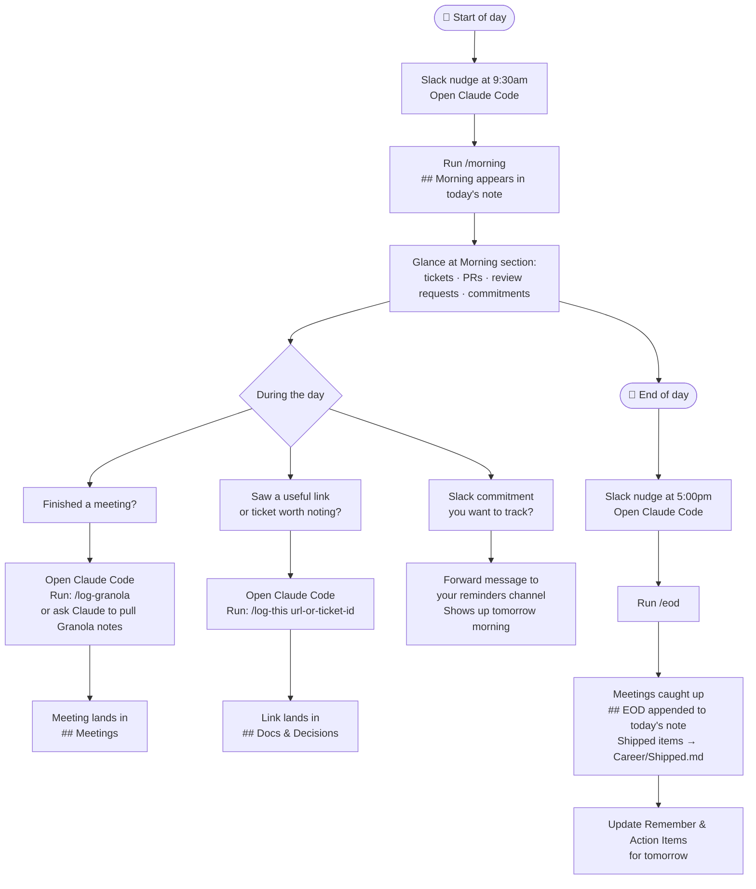

# Daily Workflow

*Brain went blank? Start here. Follow top to bottom.*

---

## The shape of a day

---

## Morning (2 min)

- [ ] Slack nudge arrives at 9:30am → open Claude Code
- [ ] Run `/morning` — pulls into today's note automatically:
  - In-progress tickets (Linear)
  - Your open PRs + review state
  - PRs where your review is requested
  - Anything you forwarded to your reminders channel

---

## During the day

| When this happens | Do this | Where it lands |
|---|---|---|
| Meeting ends | Open Claude Code → `/log-granola` (optional) | `## Meetings` in today's note |
| You open a useful doc or ticket | Open Claude Code → `/log-this [url]` | `## Docs & Decisions` in today's note |
| You made a commitment in Slack | Forward the message to your reminders channel | Shows up in tomorrow's `/morning` |
| Quick thought / reminder | Drop it in `## Remember & Action Items` | Today's note |

---

## End of day (5 min)

- [ ] Slack nudge arrives at 5:00pm → open Claude Code
- [ ] Run `/eod`
  - Catches any Granola meeting notes you didn't log during the day
  - Diffs current state against your morning snapshot
  - Appends `## EOD` to today's note (what shipped, what moved, what's carrying over)
  - Writes shipped items to `Career/Shipped.md`
- [ ] Update **Remember & Action Items** — what needs to carry to tomorrow?

---

## Where things live

| What | Where |
|---|---|
| Daily notes | `Daily notes/` |
| Meeting notes | Inside daily note → `## Meetings` |
| Shipped work log | `Career/Shipped.md` |
| Reading queue | `Links I want to read.md` |

---

## Claude Code commands

| Command | When to run | What it does |
|---|---|---|
| `/morning` | Start of day | Pulls tickets + PRs + Slack forwards → `## Morning` in today's note |
| `/eod` | End of day | Catches meetings, arc-of-day summary → `## EOD` + `Career/Shipped.md` |
| `/log-granola` | After a meeting (optional) | Pulls Granola notes → today's daily note; `/eod` catches any you missed |
| `/log-shipped` | Anytime | Just writes shipped items to `Career/Shipped.md` |
| `/my-story` | First Friday of month | Reads career Slack channel + merged PRs, writes next chapter to `Career/My Story.md` |

---

## Slack reminders (automatic, weekdays)

| Time | Day | Nudge |
|---|---|---|
| 9:30am | Weekdays | Run `/morning` in Claude Code |
| 3:33pm | Weekdays | Forward anything from Slack worth capturing to your reminders channel |
| 5:00pm | Weekdays | Run `/eod` in Claude Code |
| 2:00pm | Fridays | Run `/weekly-wins` in Claude Code |
| 2:00pm | First Friday of month | Run `/my-story` in Claude Code |

---

*You don't have to do all of this every day. Even just `/eod` at the end of the day builds the trail over time.*
